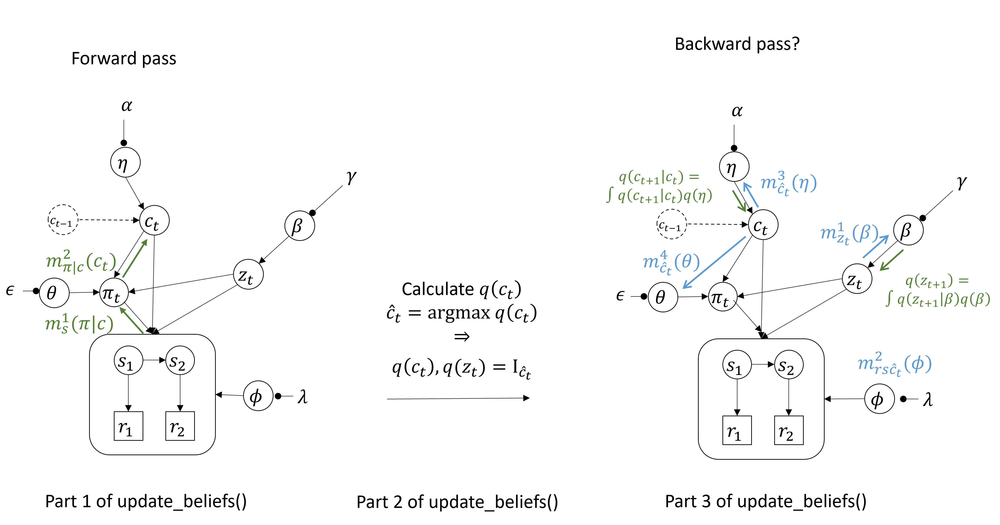

FOR SARAH:

You should work with the file:

HDP_stick_breaking/2_simulate_HDP_MAP.py

All the agent code is in agent.py. I do not have a perception class anymore. All beliefs are printed from update_beliefs.py and you can switch that on and off via setting debug=False in the agent class initialization. 

It is set up to run as an ipynb file even though it is a .py file. When you open it in vscode it should have a Run Cell option before every cell. Cells are marked like this:

#%% 
